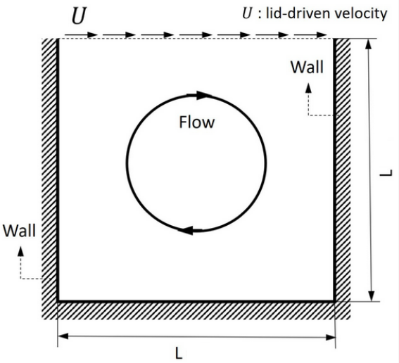
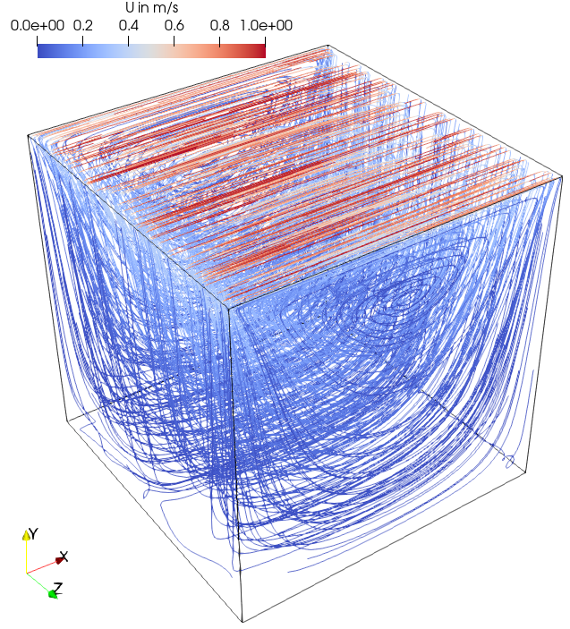
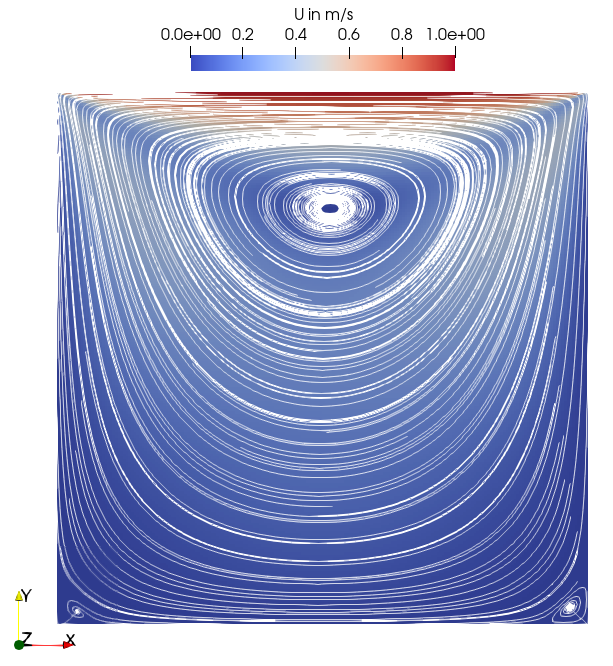
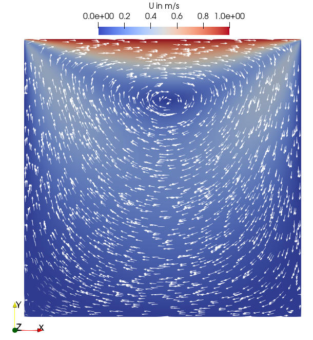

# Lid driven cavity flow
## Authors
Sergey Lesnik and Henrik Rusche, Wikki GmbH, Germany

## Copyright
Copyright (c) 2022-2024 Wikki GmbH

 

Except where otherwise noted, this work is licensed under a <a rel="license" href="http://creativecommons.org/licenses/by-sa/4.0/">Creative Commons Attribution-ShareAlike 4.0 International License</a>.

## Introduction
The flow in a cavity, which is driven by the upper cavity boundary (lid), is one of most basic and widely spread test cases for the CFD programs. It is easy to set up and validate because of the simple geometry. According to AbdelMigid et. al.[^AbdelMigid2017] the setup has been used by researchers for more than 50 years to benchmark fluid dynamics codes. Available literature on the topic includes numerical experiments for a wide range of computational algorithms and flow regimes, e.g. Ghia et. al.[^Ghia1982] provide comprehensive results for the Reynolds number ranging from 100 to 10 000. In most cases, the numerical setups are 2D whereas experimental measurements are obviously carried out in 3D as performed by Koseff et. al.[^Koseff1985].

The present setup is based on the white paper by Bnà et. al.[^Bna] and thus scaling results are available.

# Configuration and Numerical setup

Figure: Schematic of lid-driven cavity flow from Huang and Lim[^Huang2020], used under the [CC BY 4.0](http://creativecommons.org/licenses/by/4.0) license.

As shown in the figure above the lid driven cavity (referred to as "cavity" in the following) is bounded by stationary walls of the same length from all sides apart from the upper boundary. The latter moves with a certain speed. The most popular variation of the case is 2D. The present setup is 3D, which is achieved by extending the front and back walls to form a cubic cavity with a side length of 0.1 m. The lid moves with 1 m/s in the direction normal to the two opposite wall pairs. The resulting Reynolds number is 10.

## Validation
The present case has no analogues in the literature since the numerical calculations consider mostly 2D setups and available experiments deal with non-cubic geometry (e.g. cavity from Koseff et. al.[^Koseff1985] has 3:1 span to width ratio). Nonetheless, an overview of the flow is given below. The primary vortex is clearly seen in the upper part of the cavity. Two secondary vortices characteristic for the Reynolds number regime are present in both lower corners of the cross-section diagrams.

Figure: Streamlines colored by velocity magnitude

| Middle cross-section with streamlines | Middle cross-section with velocity vectors |
|-|-|
| |  |

# Microbenchmark
* Known to run with OpenFOAM-v2106 compiled with double precision (WM_PRECISION_OPTION=DP).
* The momentum predictor is switched off since it is counterproductive for low Reynolds number flows when the PISO algorithm is used.
* The cases are setup to run at Co = 1 (CFL number). If mesh size is changed, adjust the time step in 'controlDict' to keep Co = 1.
* The cases are setup to run for 15 time steps, which produces meaningful statistics for the wall clock time (see section "Methodology" for details).
* Three cases are provided. These differ in the time step and mesh size (the name provides the number of cells, e.g. "8M" stands for 8 Mio cells).
* Each case includes two setups:
	* *fixedTol* : the tolerance of the linear solver is fixed
	* *fixedIter* : the iteration number of the linear solver is fixed
* Only *fixedIter* setup should be used for profiling.
* `renumberMesh` utility is used to reduce the bandwidth of the matrix.

## Microbenchmark vs. tutorial case setup
The standard cavity case setup from the OpenFOAM tutorials does not meet the microbenchmark requirements because of the following issues:
* The case is not stationary. It deals with the start-up of the flow meaning that the flow starts to develop from 0 m/s at t = 0 s until it reaches a stationary state. The stationary state is reached after 1 s, which corresponds to the lid 10 times passing by, according to the white paper[^Bna]. For the smallest mesh with 1 Mio cells (1M) with the Courant number 1 (Co = 1) this leads to 1000 time steps, which is not feasible for a microbenchmark.
* The iteration number of the linear solver per time step n_iter differs for every time step if tolerance is setup as the convergence criterion. The iteration number also fluctuates significantly, whereby on average it decreases during the run and reaches a certain plateau at some point (for 1M case approx. after 0.34 s).
* The iteration number n_iter is also dependent on the mesh size and the decomposition.

Considering the above arguments the case is altered. It has to be adapted to the profiling requirements meaning that a compromise between the fast execution, representativeness, repeatability and simple handling needs to be achieved:
* Fast execution: A single run consists of 15 time steps.
* Repeatability: During the profiling run the iteration number of the linear solver is fixed.
* Simple handling:
	* Start at t = 0 s, no restart file.
	*  The iteration number is the same for a mesh of a certain size independent of the decomposition.
* Representativeness: The present cavity case aims to reproduce the solver behavior from t = 0 s up to the point where the iteration number reaches the plateau mentioned above. This time point differs for different mesh sizes, which is accounted for in the provided benchmark. In this way, the case is representative for the initial transient of the cavity case.

## Instructions
One of the major issues of the cavity test case is the fact that the  iteration number of the linear solver grows with increasing mesh size if the linear solver tolerance is set. Thus, the two following approaches are possible.

### Mesh size unchanged
If one of the provided cases is used without changes, only *fixedIter* setup is utilized. Simply run the Allrun script. For example:
1. `cd 1M/fixedIter`
2. `./Allrun`

### Mesh size changed
If the mesh size is changed an additional run with *fixedTol* needs to be performed to determine an iteration number which is representative for the case. The procedure is the following.
1. Adjust the time step in 'controlDict' of bothe setups *fixedTol* and *fixedIter* to keep Co = 1.
2. Run with the fixed tolerance for p: 1e-5 (*fixedTol*). The solver will run for 15 time steps. A python script analyzes the solver log file and computes the extrapolated representative mean iteration number `iter_run` needed for the next step, which is saved in 'log.python3'. E.g. for 1M case:
	1. `cd 1M/fixedTol`
	2. `./Allrun`
	3. `cat log.python3`
3. Run with fixed number of iterations (*fixedIter*). Only this setup should be used for the profiling.
	1. Go to the 'fixedIter' directory of the current case
	2. Adjust `maxIter` in the 'system/fvSolution' to the value `iter_run` read from the 'log.python3' of the *fixedTol* setup
	3. `./Allrun`

## Known issues
Besides the mesh size the iteration number also depends on the number of partitions the case is decomposed into (it grows with the increasing partition number) and on the decomposition method. In our experiments, e.g. for 64M case, the iteration number with 1024 partitions was 50% higher than with 32 partitions. The `maxIter` of the *fixedIter* setups of 1M and 8M cases are setup according to the *fixedTol* runs with 32 partitions and in case of 64M with 1024 partitions. In all cases scotch was used as the decomposition method.
The general recommendation is to follow the procedure above. Then, for a strong scaling analysis the `maxIter` stays constant, which simplifies the evaluation.
Optionally, adjusting `maxIter` for every run (when the decomposition method or number of partitions alters) accordingly to the 2nd approach described above may be considered.

## Methodology
This section describes how the cases were setup. It serves for informative purposes only and is not a part of the microbenchmark.
* The three cases were first run up to t=0.5s. For each case the following procedure was performed.
	* Find out averaged initial residual $r_c$ at the end of the run: [0.4s, 0.5s].
	* The initial residual reaches a plateau (not decreasing anymore) at some point before t=0.4s. Find out this point in time by finding at which time $1.2 r_c$ of the initial residual is reached (e.g. for the 1M case $t_c$=0.34s). Put differently, it is assumed that the
	* Calculate the averaged iteration number $iter_{run}$ from $t$ up to $t_c$.
	* Calculate the averaged iteration number $iter_{start}$ from the first *15* time steps.
	* Build a factor $a_{case}=iter_{start}/iter_{run}$.
* An average factor $a$ was build based on the three cases. It is used for the extrapolation from *fixedTol* setup to *fixedIter* setup giving a mean iteration number, which is representative for the whole run of the initial transient. In this way there is no need to run a case for the complete duration of 0.5s.
* Run the cases with the fixed iteration number $iter_{run}$ for 1000 time steps.
	* Analyze the wall clock time per time step $dt_{wc}$.
	* Compute its average $dt_{wcAv}$ and standard deviation $dt_{wcStd}$
	* Compute the sample size of time steps needed for 95% confidence level with 1% error and given $dt_{wcAv}$, $dt_{wcStd}$ according to this formula:
	$n_{dt} = 1.96^2*dt_{wcStd}^2/(dt_{wcAv}*0.01)^2$
* Several runs to evaluate $n_{dt}$ on both a workstation and on a HPC were performed. The highest $n_{dt}$ was found to be 13. Finally, it is set to 15 to be aligned with the *fixedTol* setup.

# General remarks
* Fixing the iteration number per time step n_iter is not based on a fixed tolerance run up to the stationary state (t = 1 s), which may be argued to be the actual representative case. During the run with fixed tolerance, n_iter decreases and the average value n_iterAv of the complete run would be relatively low. If the same case is run with a fixed iteration number of n_iterAv, which is too low to achieve the needed convergence, the run might end in a failure.
* CFL number of 1 is too high for the cases to depict the start-up process of the flow correctly, which may be seen when mean Co of two cases with different mesh sizes is analyzed. Co = 1 is chosen because this is closer to the industrial setups.

# Acknowledgment
This application has been developed as part of the exaFOAM Project https://www.exafoam.eu, which has received funding from the European High-Performance Computing Joint Undertaking (JU) under grant agreement No 956416. The JU receives support from the European Union's Horizon 2020 research and innovation programme and France, Germany, Italy, Croatia, Spain, Greece, and Portugal.

# References
[^AbdelMigid2017]: AbdelMigid, T. A., Saqr, K. M., Kotb, M. A., & Aboelfarag, A. A. (2017). Revisiting the lid-driven cavity flow problem: Review and new steady state benchmarking results using GPU accelerated code. Alexandria engineering journal, 56(1), 123-135.
[^Ghia1982]: Ghia, U. K. N. G., Ghia, K. N., & Shin, C. T. (1982). High-Re solutions for incompressible flow using the Navier-Stokes equations and a multigrid method. Journal of computational physics, 48(3), 387-411.
[^Koseff1985]: Koseff, J. R., & Street, R. L. (1985). Erratum:“The Lid-Driven Cavity Flow: A Synthesis of Qualitative and Quantitative Observations”(Journal of Fluids Engineering, 1984, 106, pp. 390–398).
[^Bna]: “PETSc4FOAM : A Library to plug-in PETSc into the OpenFOAM Framework”, Simone Bnà, Ivan Spisso, Mark Olesen, Giacomo Rossi
[^Huang2020]: Huang, T., & Lim, H. C. (2020). Simulation of Lid-Driven Cavity Flow with Internal Circular Obstacles. Applied Sciences, 10(13), 4583.
